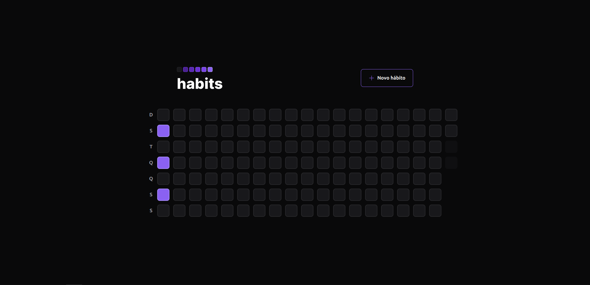
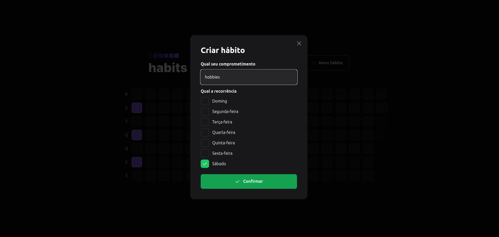
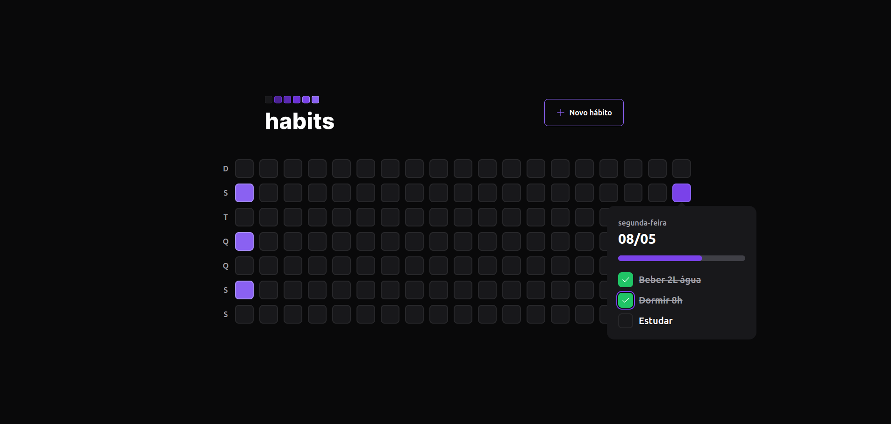

### Check out the back-end application
https://github.com/macielvini/habits-api

### How to run
1. Clone this repository
2. Install all dependencies with `npm i`
3. Run `npm run dev`

### Screenshots

